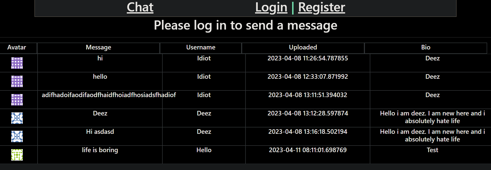
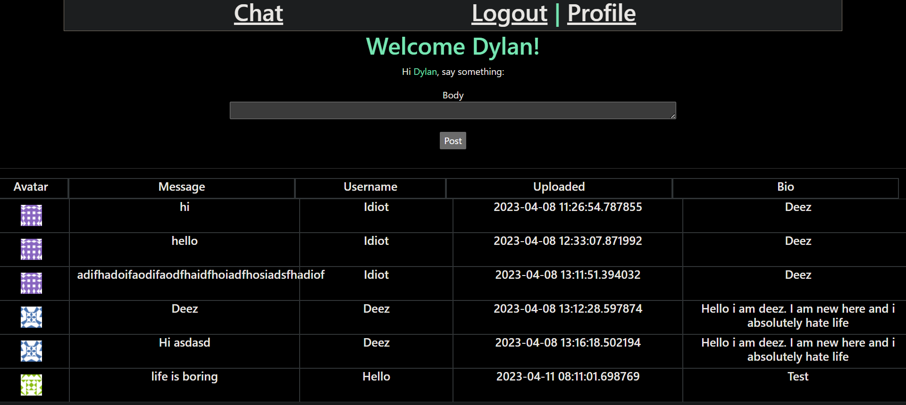

# Working with Profile Pages and avatars

> This Project was about learning how to add profile pages, user avatars and comments

> BreakDown of this project:

> In this project i learned how to add avatars using gravatar, I also added profile pages for the user and then added a posting system or a chat system 

> What was used in this project:
* html
* flask
* bootstrap
* css
> preview 1

> preview 2

> preview 3

> preview 4
